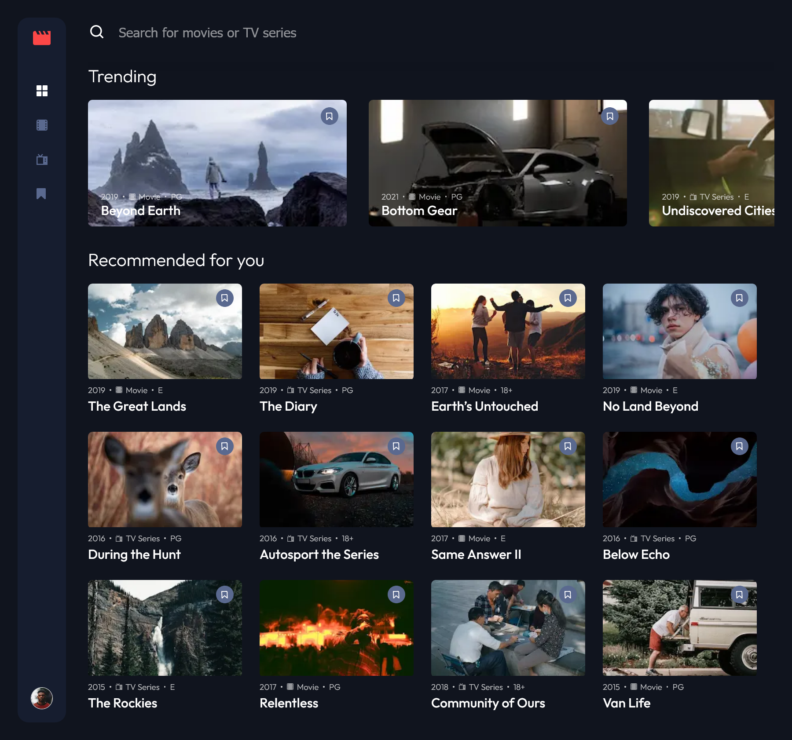
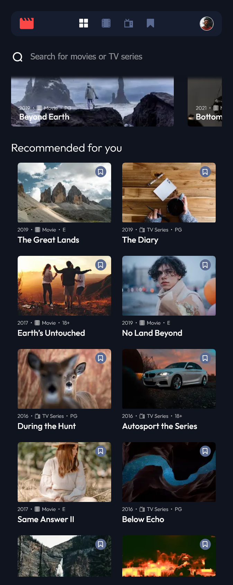
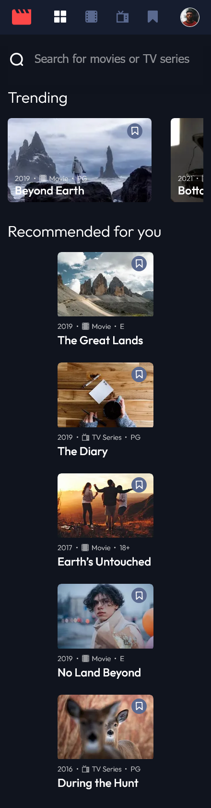

# Frontend Mentor - Entertainment web app solution

This is a solution to
the [Entertainment web app challenge on Frontend Mentor](https://www.frontendmentor.io/challenges/entertainment-web-app-J-UhgAW1X)
. Frontend Mentor challenges help you improve your coding skills by building realistic project.

## Table of contents

- [Overview](#overview)
    - [The challenge](#the-challenge)
    - [Screenshot](#screenshot)
    - [Links](#links)
- [My process](#my-process)
    - [Built with](#built-with)
    - [What I learned](#what-i-learned)
    - [Continued development](#continued-development)
    - [Useful resources](#useful-resources)
- [Author](#author)
- [Acknowledgments](#acknowledgments)

## Overview

### The challenge

Users should be able to:

- View the optimal layout for the app depending on their device's screen size
- See hover states for all interactive elements on the page
- Navigate between Home, Movies, TV Series, and Bookmarked Shows pages
- Add/Remove bookmarks from all movies and TV series
- Search for relevant shows on all pages
- **Bonus**: Build this project as a full-stack application
- **Bonus**: If you're building a full-stack app, we provide authentication screen (sign-up/login) designs if you'd like
  to create an auth flow

### Screenshot

1. Desktop screenshot
   

2. Tablet screenshot
   

3. Mobile screenshot
   

### Links

- Solution URL: [solution URL](https://your-solution-url.com)
- Live Site URL: [live site URL](https://your-live-site-url.com)

## My process

### Built with

- Semantic HTML5 markup
- Sass Cascading Style Sheets (SCSS)
- Flexbox
- CSS Grid
- Desktop-first workflow
- Typescript
- [React](https://reactjs.org/) - JS library
- [Next.js](https://nextjs.org/) - React framework
- Webstorm (IDE)

### What I learned

I learnt a lot of how react actually works. I learned how to manage state with useState and context API. and I also
learned how to handle side-effects with useEffect. This was a great experience as it allowed me to reinforce these
topics and some other fundamental concepts like callbacks, scope and many more. I also got some experience with
TypeScript which really helped me to catch bugs to deal with data types.

Some code I was really proud of writing and shocked are shown below:

1. Writing code that managed a Map collection state from Context API

```TypeScript
  const updateBookmarked = useCallback((contentId, contentTitle) => {
    if (!bookmarked.has(contentId)) {
        setBookmarked((prevState) => prevState.set(contentId, contentTitle));
    } else {
        setBookmarked((prevState) => {
            prevState.delete(contentId);
            return prevState;
        });
    }
}, []);
```

2. CSS code for hover state changes

```css
.movie-card__item:hover .movie-card__item-modal {
    visibility: visible;
}

.movie-card__item-modal {
    top: 0;
    left: 0;
    visibility: hidden;
/ / makes modal hidden until hovered position: absolute;
    width: 100%;
    height: 100%;
    z-index: 1;
}
```

3. JSX code with rendering logi

```jsx
<div className="movies">
    {currentTab === CATEGORY_HOME && curSearch.length === 0 ? (
        <TrendingMovies movies={renderedMovies}/>
    ) : (
        <></>
    )}

    {currentTab !== CATEGORY_BOOKMARKS ? (
        <MovieGrid heading={renderedHeading} movies={renderedMovies}/>
    ) : (
        <Bookmarked content={renderedMovies}/>
    )}
</div>
```

### Continued development

Going forward I want to learn how to properly manage the
application state and use good and efficient optimizations whenever possible. Also I want to focus on writing very
responsive CSS, and semantic HTML which is not a topic that is talked about a lot.

### Useful resources

- [ChatGPT](https://chat.openai.com/) - This is an amazing resource that helped me understand documentation easier and
  quicker plus also helped me understand some errors in the code.
- [CSS Loaders](https://cssloaders.github.io/) - A good resource to find css loaders which are already animated

## Author

- Website - [Alinaswe Chilyabanyama](https://www.alinaswecodes.com)
- Frontend Mentor - [@Alinaswe3](https://www.frontendmentor.io/profile/Alinaswe3)
- Twitter - [@AChilyabanyama](https://twitter.com/AChilyabanyama/)

## Acknowledgments

I would really like to acknowledge OpenAi for [chatGPT](https://chat.openai.com/) which helped me resolve errors quickly
and effectively. I would encourage developers to utilize this powerful tool during development as it reduces the
development time.
